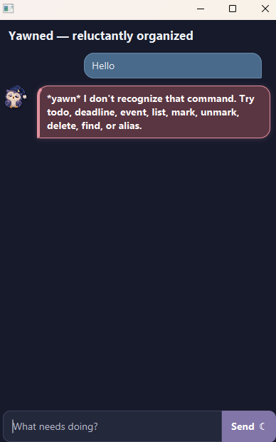

# Yawned User Guide

**Yawned** is a sleepy but dependable task-management chatbot. Type commands in the app's input box and press Enter (or select **Send**); it saves changes automatically.

## Start here

1. Start Yawned with Java 25.
2. Add a task, for example: `todo borrow a book`.
3. Use `list` to see its number, then `mark 1` when you finish it.

Use the graphical app throughout, close its window when you are done.

## Command format

- Use the commands exactly as written; task descriptions may contain spaces.
- `INDEX` means the task number shown by `list`, starting at 1.
- Dates and times use `yyyy-MM-dd HHmm`, for example `2026-04-10 1430`.
- Your tasks and custom aliases are saved automatically in the `data` folder.

## Task types

| Type | Use it for |
| --- | --- |
| To-do | Something to do with no associated date or time. |
| Deadline | Something that must be finished by a particular date and time. |
| Event | Something that takes place between a start and end date and time. |

## Manage tasks

| What you want to do | Command | Example |
| --- | --- | --- |
| Add a to-do | `todo DESCRIPTION` | `todo borrow a book` |
| Add a deadline | `deadline DESCRIPTION /by DATE TIME` | `deadline submit report /by 2026-04-10 1430` |
| Add an event | `event DESCRIPTION /from DATE TIME /to DATE TIME` | `event team meeting /from 2026-04-10 1400 /to 2026-04-10 1500` |
| View every task | `list` | `list` |
| Find matching tasks | `find KEYWORD` | `find report` |
| Mark a task complete | `mark INDEX` | `mark 1` |
| Mark a task incomplete | `unmark INDEX` | `unmark 1` |
| Delete a task | `delete INDEX` | `delete 1` |

`find` matches task descriptions without changing your saved task list.

## Shortcuts and aliases

Yawned includes these built-in shortcuts:

| Alias | Command |
| --- | --- |
| `t` | `todo` |
| `d` | `deadline` |
| `e` | `event` |
| `l` | `list` |
| `m` | `mark` |
| `u` | `unmark` |
| `del` | `delete` |
| `f` | `find` |

| What you want to do | Command | Example |
| --- | --- | --- |
| See all shortcuts and custom aliases | `alias list` | `alias list` |
| Create or replace a custom alias | `alias NAME COMMAND` | `alias hw todo` |
| Remove a custom alias | `alias remove NAME` | `alias remove hw` |

Custom alias names use letters only and are case-insensitive. Alias targets must be one of the standard task commands, such as `todo`, `deadline`, or `list`.

## A quick example

~~~
todo buy milk
deadline submit report /by 2026-04-10 1430
list
mark 1
find report
~~~

If a command is incomplete or misspelled, Yawned explains what it needs and gives a usable example.
