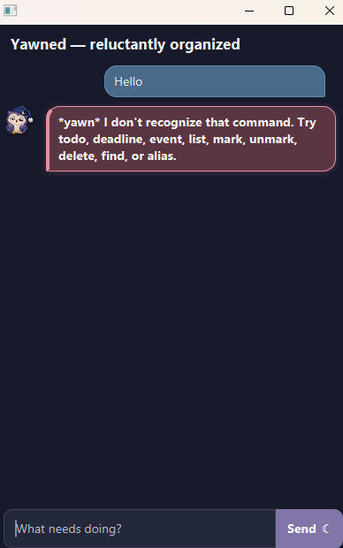

# Yawned User Guide




**Yawned** is a sleepy but dependable task-management chatbot. Type commands in the app's input box and press Enter (or select **Send**); it saves changes automatically.

## Start here

1. Start Yawned with Java 25.
2. Add a task, for example: **todo borrow a book**.
3. Use **list** to see its number, then **mark 1** when you finish it.

In the graphical app, close the window when you are done. In the console app, end the input stream with Ctrl+Z then Enter on Windows.

## Command format

- Use the commands exactly as written; task descriptions may contain spaces.
- **INDEX** means the task number shown by **list**, starting at 1.
- Dates and times use **yyyy-MM-dd HHmm**, for example **2026-04-10 1430**.
- Your tasks and custom aliases are saved automatically in the **data** folder.

## Manage tasks

| What you want to do | Command | Example |
| --- | --- | --- |
| Add a to-do | **todo DESCRIPTION** | **todo borrow a book** |
| Add a deadline | **deadline DESCRIPTION /by DATE TIME** | **deadline submit report /by 2026-04-10 1430** |
| Add an event | **event DESCRIPTION /from DATE TIME /to DATE TIME** | **event team meeting /from 2026-04-10 1400 /to 2026-04-10 1500** |
| View every task | **list** | **list** |
| Find matching tasks | **find KEYWORD** | **find report** |
| Mark a task complete | **mark INDEX** | **mark 1** |
| Mark a task incomplete | **unmark INDEX** | **unmark 1** |
| Delete a task | **delete INDEX** | **delete 1** |

**find** matches task descriptions without changing your saved task list.

## Shortcuts and aliases

Use these case-insensitive shortcuts in place of the corresponding lowercase command word:

| Alias | Command |
| --- | --- |
| `t` | `todo` |
| `d` | `deadline` |
| `e` | `event` |
| `l` | `list` |
| `m` | `mark` |
| `u` | `unmark` |
| `del` | `delete` |
| `f` | `find` |

For example, `T buy milk` is equivalent to `todo buy milk`, and `DeL 2` is equivalent to
`delete 2`. The `bye` command has no alias. Canonical commands remain lowercase.

### Custom aliases

Create or replace a persistent alias with `alias <name> <command>`. Names contain letters only and are
case-insensitive; targets must be one of `todo`, `deadline`, `event`, `list`, `mark`, `unmark`, `delete`,
or `find`.

```text
alias hw todo
HW finish assignment
```

Remove a custom alias with `alias remove <name>`:

```text
alias remove hw
```

Custom aliases are saved in `data/aliases.txt` and remain available after restarting Yawned. They cannot
replace canonical command words, built-in aliases, `alias`, or `remove`; they also cannot target `alias`.


## Adding deadlines

// Describe the action and its outcome.

// Give examples of usage

Example: `keyword (optional arguments)`

// A description of the expected outcome goes here

```
expected output
```

## Feature ABC

// Feature details


## Feature XYZ

// Feature details
